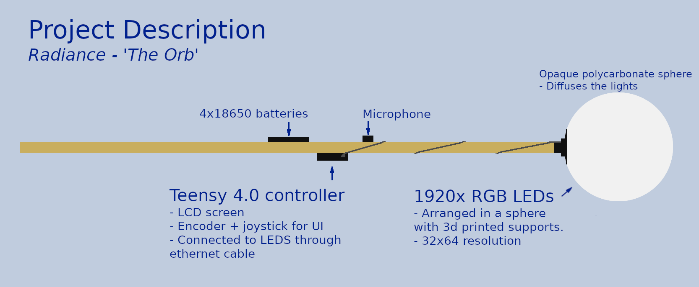

# TeensyEngine

TeensyEngine is primarily the software I use for my Totem Pole - named *The Orb*. 


Included in this repository is a description of both the hardware and software features, and eventually the MCAD/ECAD designs for everything.
It includes an emulator that's using OpenFrameworks for display and UI control, allowing easy testing and development.


## Contents 
- [About](#about)
- [Features](#features)
- [Hardware](#hardware)
- [Software](#software)
- [Credit](#credit)


## About
I took ~2000 LED lights and carefully shoved them inside a polycarbonate ball that was then placed on top of a stick and hooked up to a microprocessor and battery pack. Shockingly, it worked quite well! I use it as a Totem Pole primarily music festivals, come say hi if you see it!

This has been a multiyear endevour that I've slowly added more and more features to. It's the 4th iteration of the hardware including LEDs and controller/batery box. The first version was a couple of LEDs taped down inside two salad bowls - [how far this project has come since then!](buildLog/README.md#previous-versions

Just a heads up - I'm a completely self taught programmer/3d modeler/electronics designer, there is a level of *jank* at times that should be expected to come of that, but overall I've been very pleased with the outcome! 
I will glady take any suggestions or tips to improve my work, please comment any suggestions!



## Features
- 25+ different patterns with the ability to change the colour pallete being used for most patterns!
- Custom global blur/fade/glitter effects that can run on top of any pattern
- Text overlay onto patterns with the ability to enter custom text using the controller
- LCD Screen for changing settings/patterns + showing battery voltage and power usage
- Current sensor for monitoring power usage
- Encoder + buttons for navigating the UI
- An accelerometer (because why not)
- Microphone input 
- Wireless compatibility with NRF24L01 or ESP-01

https://user-images.githubusercontent.com/25134458/209674595-40512c94-f8f8-4173-94cc-6f29fc267113.mp4

## Hardware
Some photos of the completed project can be found [here](buildLog/README.md).
I made a custom circuit board for connecting everything up along with a daughter board for [powering](#Power) the leds and providing the data through a CAT5 cable. 

#### Processor
A teensy 4.0 is the heart of the project, providing plenty of raw power to overcome my inefficient coding and push out LEDs while controling a UI.

#### Accessories
- Microphone - I can't remember what I'm using, one of the sparkfun electret autogain boards. 
- NRF24l01 - used to connect wirelessly to LED headbands - allows you to change the patterns/brightness/colour of the headbands!
- ESP-01 - pins to connect to an ESP are broken out but not yet implemented
- ACS712 current sensor in series with the LEDs to measure power usage
- MSGEQ7 - the pinout is there but I haven't ended up using it yet
- ILI9341 colour TFT display 240x320 
- MPU9250 accelerometer

If trying to make this project, please confirm the pinout matches for the display and accelerometer! I got caught out and assumed they were the same for the two almost identical accelerometers I had, then needed to edit the circuit board. Also the linear regulator for the processor 5V line got way too hot so I changed it for a small buck convertor that (roughly) matched it's footprint. To be honest the circuit board could be redone with a teensy 4.1, as soldering the pogo pins to connect to the back of the teensy 4.0 was very tedious. 

#### Lights
Custom 3d printed scaffolding for strips of SK6805-2427 RGB LEDs, to hold them in a sphereical shape inside a polycarbonate ball 25cm in diameter. They're held slightly back from the inside of the sphere to help diffuse the lights nicely. The scaffolding press fits together and tolerances were set for my 3d printer - YUMV. They're also held in place under slight compression from the globe. I won't lie, it took a long time to cut/strip the wires and solder everything all together, I probably didn't need to but I also added extra connections in the middle of the strips for power/ground and stability in holding everything in place. The LED strips are arranged as 30 to a strip with an offset pattern to reduce crowding at the poles, allowing for an effective resolution of 32H x 64W. See the [build details](buildLog/README.md) for photos. 

The lights are from [Aliexpress](https://www.aliexpress.com/item/32818340106.html?spm=a2g0o.order_list.order_list_main.358.679f1802EQyb32), and were chosen for their high density (120/M, 8.33mm pitch) and thin strips (6mm width). 
Lights with a smaller pitch and thinner stip were outrageously expensive at the time I was purchasing LEDs, but have since come down in price somewhat... Version 5 [TBC](https://www.aliexpress.com/item/1005003798198621.html?spm=a2g0o.productlist.main.1.1ec91845yMUVny&algo_pvid=75d3a123-2f4a-48b9-b82f-fbbad28e56ed&algo_exp_id=75d3a123-2f4a-48b9-b82f-fbbad28e56ed-0&pdp_ext_f=%7B%22sku_id%22%3A%2212000028080815414%22%7D&pdp_npi=2%40dis%21AUD%2140.15%2126.11%21%21%21%21%21%40211bf14716719782508633629d0742%2112000028080815414%21sea&curPageLogUid=63plojRdJNp2)?

#### Power
The whole thing is powered by 4x 18650 batteries, I usually carry a spare set of 4x batteries for each night that it's used which usually lasts the night through.
There's a step-down converter in the controller providing 5V for the teensy and accessories. The full battery voltage is sent up to the LEDs where there is a seperate Pololu [D24V150F5](https://www.pololu.com/product/2881) Step-down convertor. The benefit of the two power supplies is efficiency and stability - it avoids the much higher current that would be needed from sending 5V to the LEDs (and the voltage drop since it's a decent 1M run!), and a seperate and stable power source for the controller that doesn't dip when the LEDs draw a bunch of power. It also means I can provide much more power than most USB powerbanks, although I do want to try sending 20v from a 100w USB C powerbank to the leds.


## Software
The software include a basic emulator that runs the same UI and pattern software using Openframeworks to display the LEDs. 

I've tried to organise the UI controls into roughly similar pages.

<details>
  <summary>Videos</summary>
 
  https://user-images.githubusercontent.com/25134458/209736586-94fa050d-8a2f-43fb-920e-38acb0f2c6ba.mp4

  
  https://user-images.githubusercontent.com/25134458/209676572-e61da54b-b9a8-4b95-bfd1-fcbd3a2c399e.mp4
  
</details>

#### Pattern controls
- Select desired patterns from the list of patterns


- Change overall brightness
- Select a tempo + tap tempo
- Change the tempo oscillator between square/ramp/sine etc...
- Trigger ability to change a patterns settings (e.g. trigger different settings for a pattern without making a complete new one, see )
#### Colour controls

    
- Change current pallete with a palette preview option
- Blend amount when changing palletes over - quick or slow blend
- Change how fast colours from a palette are cycled through
#### Text/Fx controls
- Add transparent or opaque text over any pattern, or just blink text 
- Text scroll speed
- Select the text from a list or enter custom text (12 char max only!)
- Global blur/fade/glitter effects
#### Wireless controlls
- Control the wireless headbands I made using NRF24L01 communication
- Change the pattern/colour/brightness of headbands in range
#### General settings
- LCD Backlight/Dither/Colour temp/Accelerometer/Save/load settings

### Adding a new pattern
The basic format for a pattern is a class inheriting from the `_Pattern` class, and should have the name for the pattern passed to it.

A `drawFrame()` function should be provided that is called to run the pattern. You can set the delay in msec for when to draw the next frame by the value you return. It also provides functions that are automatically called when starting or stopping a pattern, and a trigger option. Helper functions for drawing to the LED matrix are in the `gfx` class from `Graphics.h`. Try using `gfx.getColour(uint8_t offset)` for colours because this links in to the palette system. 

Include the code for a new pattern in `src\patterns\PatternController.h`, then add it as a member to the `PatternController` class and include it in the `patternList`
<details>
<summary>Example pattern</summary>
  
#### Blink all leds on/off
  ```
  class PatternBlink : public _Pattern {
  public:
    PatternBlink() : _Pattern("Blink") {}
    uint8_t drawFrame() {
      if (++count > 100) {
        count = 0;
        flip != flip;
      }
      if (flip) gfx.fill(gfx.getColour());
      else      gfx.fill(CRGB::Black);
      return returnVal; //default 10, 1000/10 = 100fps
    }
    uint8_t count = 0;
    bool flip = false;
  };
  ```
</details>


## Arduino code
The Teensyduino core was used for compiling and uploading.
`Graphics.h` does all the heavy lifting for helper functions. 

Arduino libraries used:
- [ILI9341_t3n](https://github.com/KurtE/ILI9341_t3n)
- [Encoder](https://github.com/PaulStoffregen/Encoder/blob/master/Encoder.h) from Paul Stroffregen
- [MPU9250](https://github.com/kriswiner/MPU9250) from kriswiner
- [FastLED](https://github.com/FastLED/FastLED)
- [Teensy ADC](https://github.com/pedvide/ADC)
- [RF24](https://github.com/nRF24/RF24)


## PC Emulator 

https://user-images.githubusercontent.com/25134458/209675905-0a1664af-fdfa-492f-b072-93c58537c89a.mp4

#### Requirements 
Openframeworks 0.10.1 was used for the graphics, with the ofxGui addon.

Visual Studio 2019 was used for compiling.
At one point I had it compiling on mac xcode, but I haven't checked if that still works in a while.

<details>
  <summary>The emulator has keyboard controls for the UI:</summary>
  
  - WASD: joystick up/left/down/right
  - Q/E: encoder rotate clockwise/counterclockwise
  - F: joystick press 
  - space: seperate trigger, triggers effect on certain patterns (calls Pattern::Trigger())
  - Home/End/Del/PgDown: change pitch/roll level to emulate accelerometer changes
  - I: add random impulse to accelerometer data
  - 1 through 7: change beat type (RAMP, INVERSE_RAMP, TRIANGLE, SQUARE, SIN, TRIGGER, GATE, AUDIO, AUDIO_AVG, OFF)
</details>

## Credit 
This project has taken inspiration from countless different sources. Please see [CONTRIBUTIONS.md](CONTRIBUTIONS.md) for full details. 
