# Build Log

## Contents
- [LEDS](#leds)
- [Power](#power)
- [Controller](#controller)
- [Previous Versions](#previous-versions)
  

## LEDS
I wanted as many LEDs as possible, and I wanted them held back enough from the polycarbonate shell to diffuse them nicely. 
I 3d modelled some scaffolding using ideas that had worked well from my previous attempts. The pieces press fit together, and once the LEDs are on, they're held in place quite firmly. It's built in 8 sections in order to fit inside the opening for the polycarbonate sphere (Only a ~10cm opening!), with a top and bottom piece to hold it in place. The top section can be tightened against the shell to help hold everything snug. 

### 3d Modelling the LEDs
This was one of the most complex models I'd made thus far, I needed to split the design up into sections that could break apart and be reconnected inside the globe, but I didn't want anything touching the sides as this would cast shadows and be visible (something V3 showed). This meant it needed a lot of rigidity to sandwich it inside the sphere from the top and bottom and not move around. 

I tried to design the profile to give as much space in the centre for my hand for getting inside, but still maintaining rigidity.
You can see how the LEDs interfere which each other at the top - it's wasted resolution up the top/bottom anyway and it gets crowded up there which is why the LEDs are offset from each other. 

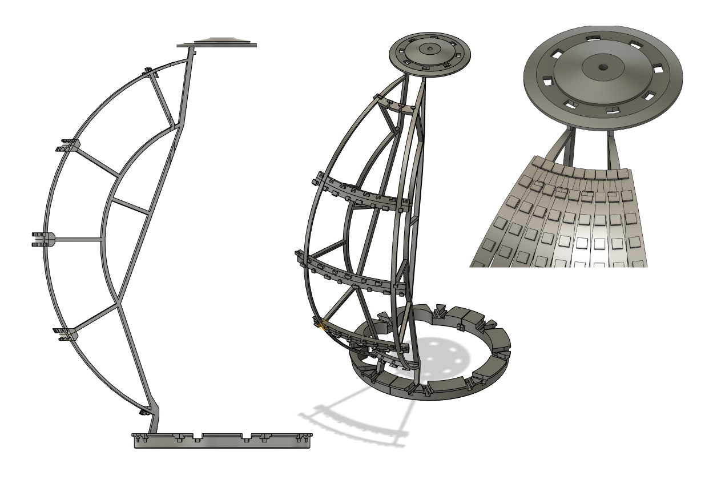

### Building the LED holders. 
One of the 8 sections printed. 

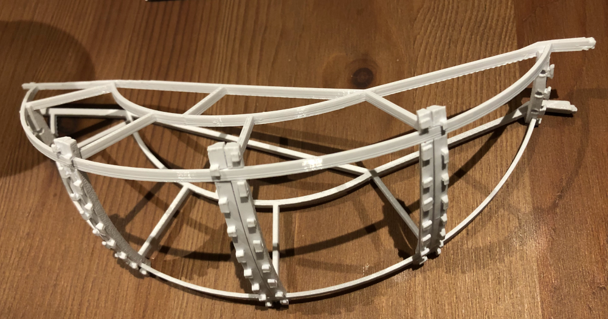

These are SK6805-2427 RGB LEDs from [Aliexpress](https://www.aliexpress.com/item/32818340106.html?spm=a2g0o.order_list.order_list_main.358.679f1802EQyb32), the strips have a pitch of 8.33mm (120 LEDs per metre), and are only 6mm wide! In total I used 64x strips of 30, with separate power and data lines to each section of 8x strips. I won't lie, it took a long time to cut/strip the wires and solder everything all together, I probably didn't need to but I also added extra connections throughout the strips for distributing power/ground around and added stability in holding everything in place. 

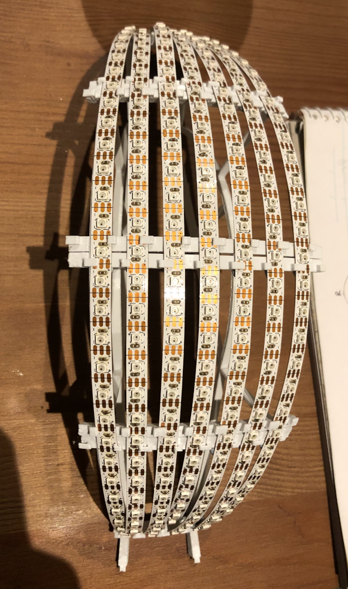

Test fit of everything together. You can see how the LEDs are offset from each other to make space at the top/bottom. 

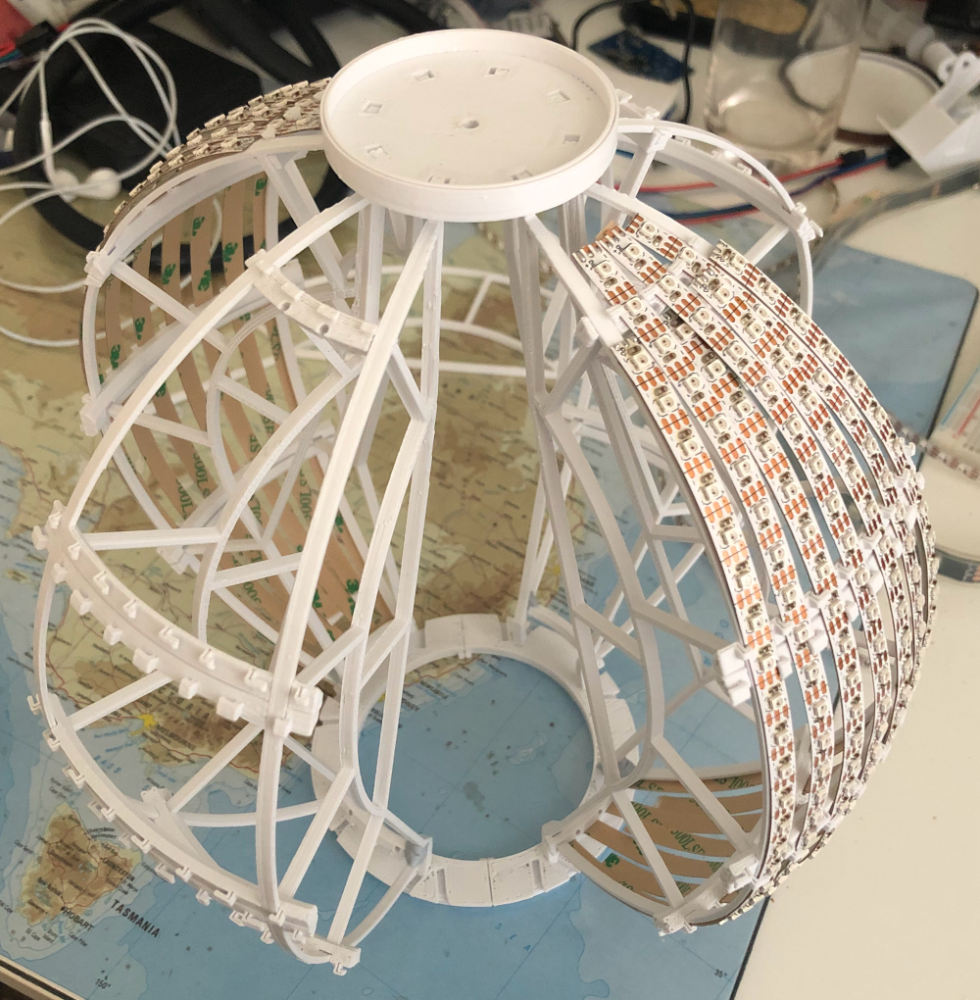

Checking if the LEDs all light up and my matrix XY() code works.
  
https://user-images.githubusercontent.com/25134458/209637888-4b88d217-abbb-4099-afa3-3a01516f0b0f.mp4

https://user-images.githubusercontent.com/25134458/209641775-9f14f9cc-60d3-4ed1-b838-ff2e159a5c03.mp4

Once I had each section built and connected, they needed to somehow be placed inside the shell and properly lined up. It was like building a ship in a bottle, but with lots of careful squeezing and manoeuvring all 8 sections were somehow in place and could be connected up to the bottom support to hold them in place. 

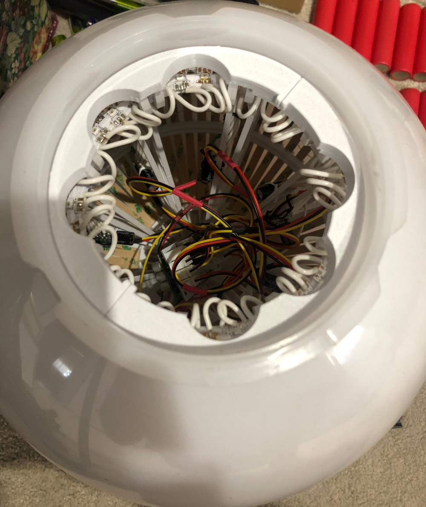

I'm really happy with how the diffusion effect turned out, the lights are held back at almost the perfect distance. 

https://user-images.githubusercontent.com/25134458/209674595-40512c94-f8f8-4173-94cc-6f29fc267113.mp4

## Power
Previously I had powered V1 and V2 from initially 2xAA batteries. V3 kicked it up a notch going up to 288 LEDs so I went with 4xAAA batteries, but it still struggled if I turned up the brightness and would glitch out or freeze. It worked okay for V3 but moving up to ~2000 LEDs I needed something stronger. 

I used 4x 18650 batteries in a standard holder from amazon and changed it to a the barrel connector. The full battery voltage is sent up a wire to the LEDs at the top of the pole, and plugs into the daughter board up there. This allowed me to send the full battery voltage (~15V) up to the LEDs without needing a heavy gauge wire. There's a beefy [Pololu D24V150F5](https://www.pololu.com/product/2881) 5V 15A buck converter up there that does an amazing job for its size. This thing is expensive (and seems to have almost doubled in price since I bought one - ouch) but can handle up to 15A at 5V reliably and pretty efficiently, which is important since the LEDS draw ~0.5A (at 15V!) even when off with just their standby current! I guess 0.8ma per led adds up when there are 1920 of them... There's a separate step-down converter in the controller which avoids software freezes and glitches ~~if~~ when the LEDs draw too much current and dip the voltage. 

The connection for the LEDs is an ethernet cable, like with the [Teensy OctoWS2811](https://www.pjrc.com/store/octo28_adaptor.html). In theory, you should be able to connect an OctoWS2811 directly to the daughter board without any issues since I've used the same circuit as the OctoWS2811 to output data lines from the Teensy. Having 8 independent LED sections allowed 8 data wires for parallel output and a reasonable framerate, using a single data line for 1920 LEDs would have resulted in a framerate < 10fps.  

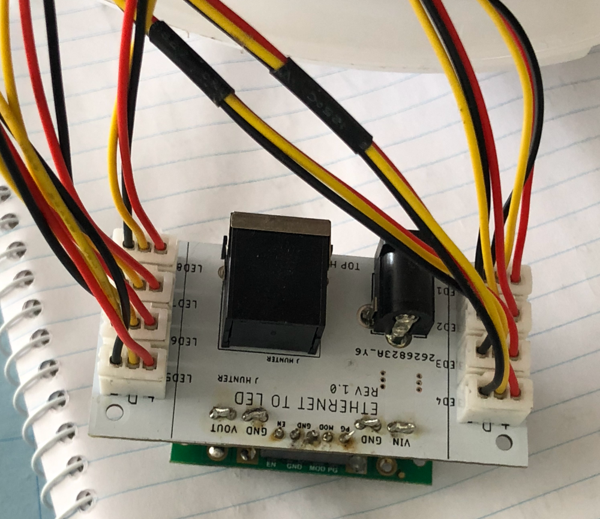

To avoid an absolute rats nest of wires at the top and bottom of the strips (128 wires for power/ground + data lines... no thanks!), I injected power into the middle of the strips. Each section of 8x strips (8 sections total) gets a data/power/ground connection from the daughter board, which goes to a small piece of protoboard with a capacitor and 8 ground/power wires for each strip. 

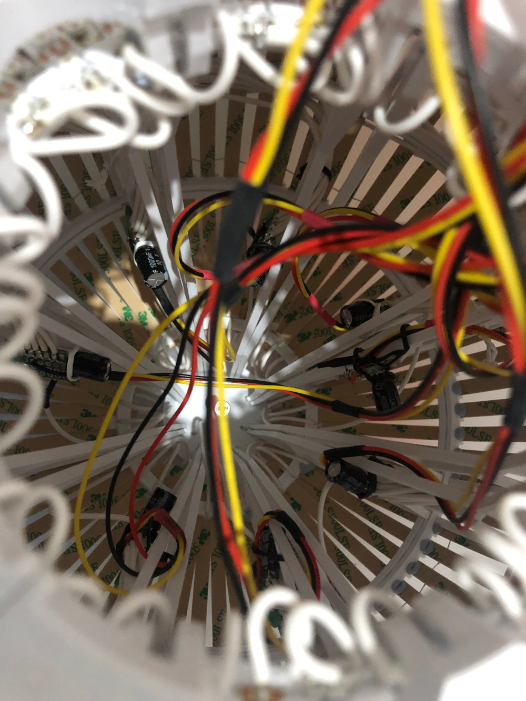

## Controller
I found a much larger 240x360 colour TFT that was the basis for the new controller, version 3 had a tiny 128x64 OLED screens that was monochrome and almost useless due to it's small size. It's much nicer actually being able to see the screen and having a colour screen allowed for a preview of the colour palettes. 

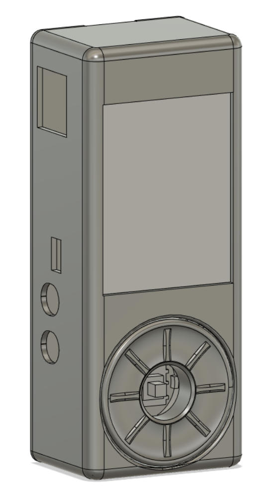

I wanted input controls similar to an iPod classic, but designing a capacitive encoder seemed overkill and likely to become its own project, so I settled for a hollow encoder with a joystick in the centre. I was testing everything with an ESP32 initially, which worked okay but was missing some grunt. Around this time the Teensy 4.0 was released and it blew everything else out of the water performance wise, I pivoted over to use it instead and I'm so glad I did. 

The controller has pinouts for a NRF24L01, I've used this to connect to a set of headbands I made and can transmit colour/pattern change messages to them. 

  
Headbands details/photos

  
  The headbands have a mere 14 LEDs on them in a waterproof casing, connected to a small circuit board that holds an ATTINY and an NRF24L01, powered by 2xAA batteries in a 3d printed case. The case is a little bulky but has a nice curve that conforms to the back of your head. It's proven to be a pretty sturdy design, none of the 12 I made have broken yet... A couple patterns and the NRF code is at the limit of what the ATTINY can do, though it's impressive for a DIP8 chip! Technically powering the LEDs from 3V shouldn't work and I was prepared to squeeze a boost converter in there, but I got lucky and it worked fine for the LEDs I had on hand! 
  
  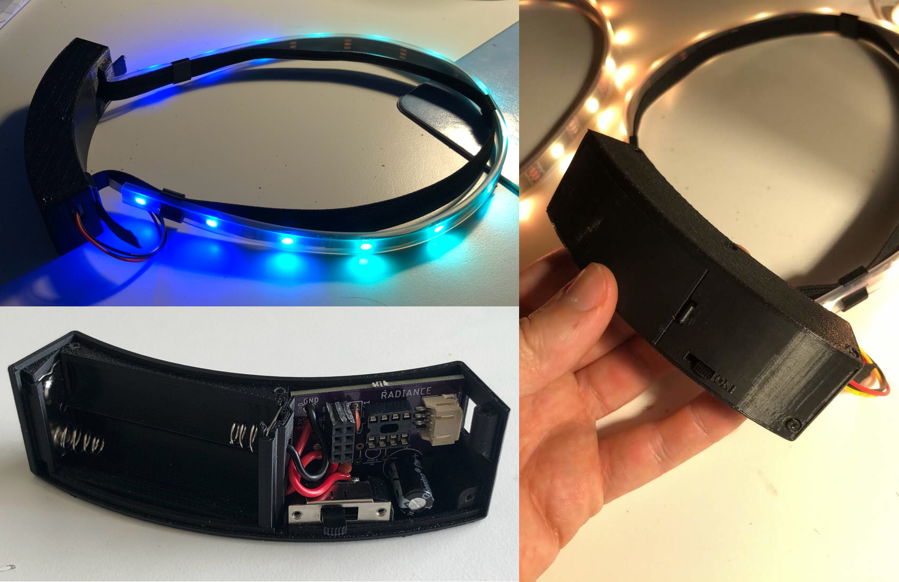
  
  

## Previous versions
### Version 1  
The initial design for a Totem poll called for lasers shining on a crystal in the centre, in an attempt to get a bunch of refraction and look interesting. This did not work at all. Luckily I had added a handful of WS2812 LEDs around, and at the last minute tapped them to the bottom so it at least lit up somewhat brightly. I  had spray painted the pole and bowls which was a poor choice as it would rub off onto your hands and made everything tacky - truly terrible!

### Version 2 
I scrapped the lasers, but went big on the LEDs which had worked the best. I found these excellent partially opaque polycarbonate shells 25cm in diameter, and tapped 9x strips of 8 WS2812 LEDs to the inside of it. It was much better than V1, but the tape came loose during the festival and some of the strips weren't always sitting up against the shell. This looked better than and ended up giving a nice diffuser effect to these lights to make them less of a pinpoint of light, giving me the inspiration for V3. 
  
 
    
Photos

  
  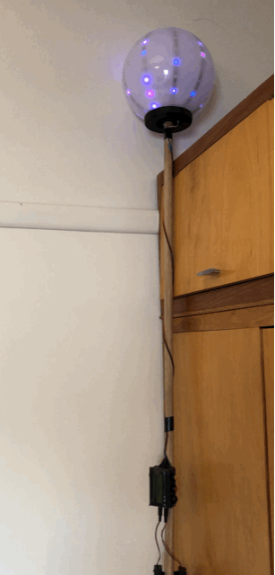
  
  

  
### Version 3 
This was where I started to get serious. If 72 LEDs looked so good, what if I had 4x as many?  I used 16x strips of 18 WS2812 leds, and 3D printed brackets to hold the LEDS in place and off the shell to get the diffuser effect. I designed my first circuit board for the control box to tidy things up and 3d printed a case for it as well. This version had enough resolution to even write basic words on it, but I knew I could squeeze in more LEDs if I tried...

  
 
    
Photos

  
  Here you can see the layout of the LEDs, with the top piece holding them in place, and a spacer in the middle resting against the sphere shell. The 4 rods hold up the center piece, but it was too bulky and these rods too flimsy to keep reasonable tension. The middle spacers worked well but the part up against the shell cast a shadow from the LEDs to the side of them. This design had a lot of snap fits which worked surprisingly well overall. 
  
  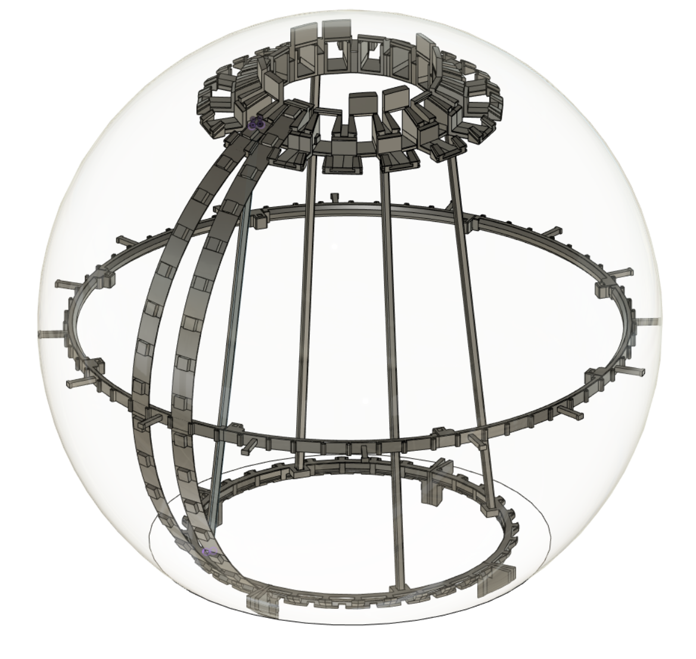
  
   You can see how the support rods are bending and the obligatory token capacitor for WS2812 leds. 
  
  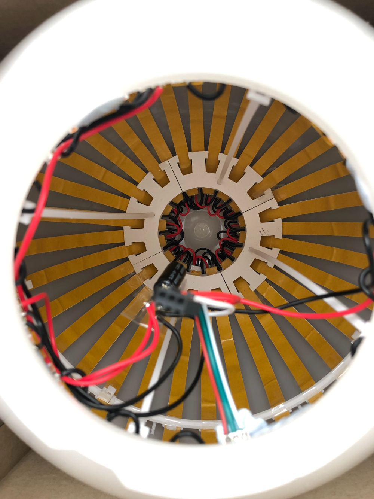

https://user-images.githubusercontent.com/25134458/209637023-156c7152-dfb4-41f7-a652-bb55d0df1f59.mp4

  
  

