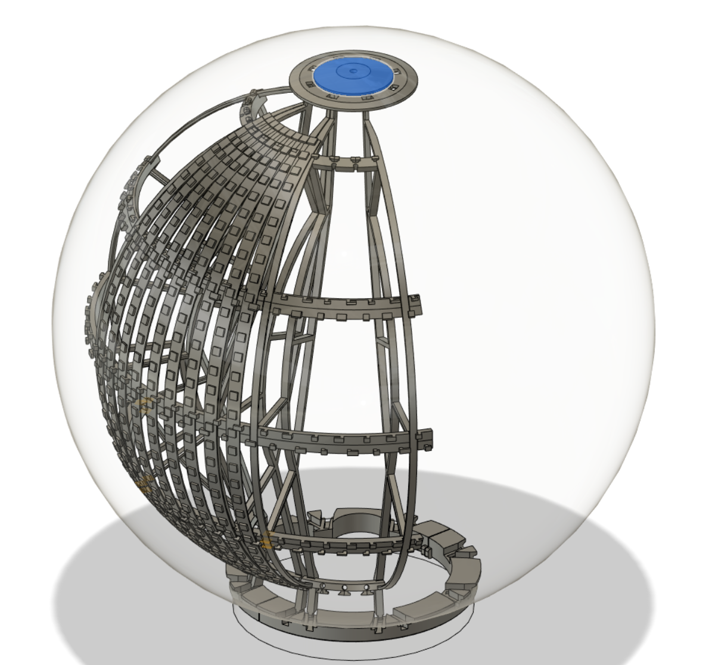

# Build Log

I wanted as many LEDs as possible, and I wanted them held back enough from the polycarbonate shell to diffuse them nicely. 
I 3d modeled some scaffolding using ideas that had worked well from my previous attempts. The pieces press fit together, and once the LEDs are on they're held in place quite firmly. It's built in 8 sections in order to fit inside the opening for the polycarbonate sphere (Only a 10cm opening!), with a top and bottom piece to hold in place. The top section can be tightened against the shell to hold everything snug. 

## Contents
- [LEDS](#leds)
- [Power](#power)
- [Previous Versions](#previous-versions)
  

## LEDS
#### 3d Modeling the LEDs
This was definitely one of the most complex models I'd made thus far, I didn't want anything touching the sides as this would cast shadows and be visible (something V3 showed). This meant it needed a lot of rigidity to sandwich it inside the sphere form the top and bottom and not move around. 

I tried to design the profile to give as much space in the centre for my hand for getting inside, but maintaining rigidity.

Here you can see how the leds interfere which each other at the top - it's wasted resolution up the top/bottom anyway which is why I offset the leds from each other. 

#### Building the LED holders. 

One of the 8 sections printed. 

You can *just* see how the leds are offset from each other to make space at the top/bottom. 

Test fit of everything together. 

Checking if the LEDs all light up and my matrix XY() code works. 

## Power
Previously I'd powered V1 and V2 from initially 2xAA batteries. V3 kicked it up a notch going up to 288 LEDs so I went with 4xAAA batteries but it struggled if I turned up the brightness and would glitch out. It worked okay for V3 but moving up to ~2000 LEDs I needed something stronger. 

## Previous versions *Look how far we've come*
##### Version 1  
The initial design called for lasers shining on a crystal in the centre. This didn't work at all. Luckily I had added a handful of WS2812 leds at the last minute and tapped them to the bottom so it at least lit up somewhat brightly. I also had spray painted the pole and bowls which just made everything tacky - terrible!

##### Version 2 
I scrapped the lasers, but went big on the LEDs which had worked the best. I found these excellent partially opaque polycarbonate shells 25cm in diameter, and tapped 9x strips of 8 WS2812 leds to the inside of it. It was much better than V1, but the tape came loose during the festival and some of the strips weren't always sitting up against the shell. This looked better than and ended up giving a nice diffuser effect to these lights to make them less of a pinpoint of light, giving me the inspiration for V3. 
  
 
    
Photos

  
  
  

##### Version 3 
This was where I started to get serious. If 72 leds looked so good, what if I had 4x as many?  I used 16x strips of 18 WS2812 leds, and 3D printed a brackets to hold the LEDS in place and off the shell to get the diffuser effect. I designed my first circuit board for the control box to tidy things up and 3d printed a case for it as well. This version had enough resolution to even write basic words on it, but I knew I could squeeze in more LEDs if I tried...

  
 
    
Photos

  
  
  Here you can see the layout of the LEDs, with the top piece holding them in place, and a spacer in the middle resting against the sphere shell. The 4 rods hold the center piece up but the centre piece was too bulky and these rods too flimsy to keep reasonable tension. The middle spacers worked well but cast a shadow from the LEDs to the side of them. This design had a lot of snap fits which worked suprisingly well overall. 
  
  You can see how the support rods are bending and the obligatory token capacitor for WS2812 leds.
  
  

